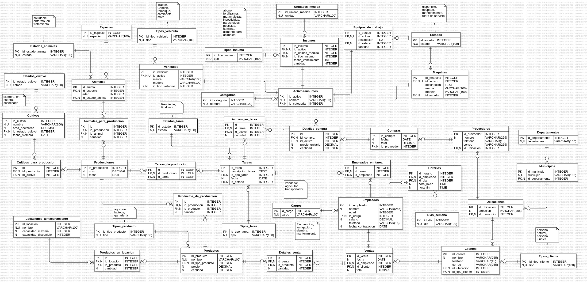

# Gestión de Hacienda-AgroNova

## Descripción del Proyecto

El proyecto **Gestión de Hacienda-AgroNova** está diseñado para gestionar y optimizar las operaciones relacionadas con la producción agrícola de la finca. La base de datos creada permite gestionar diversos aspectos de la finca, como la producción de cultivos y animales, el inventario de productos e insumos, la gestión de empleados, ventas, compras y la relación con clientes y proveedores.

### Funcionalidades principales:
- **Gestión de Cultivos y Animales**: Registro de las especies, estado y rendimiento de los cultivos y animales.
- **Control de Inventario**: Seguimiento del inventario de productos agrícolas, insumos y activos de la finca.
- **Manejo de Ventas y Compras**: Gestión de las ventas realizadas a clientes y compras a proveedores.
- **Asignación de Tareas**: Organización y seguimiento de tareas asignadas a empleados y equipos de trabajo.
- **Automatización con Procedimientos y Triggers**: Automatización de actualizaciones en inventarios, reportes y seguimiento de estado.
- **Reportes Financieros**: Generación de reportes de ventas, costos operativos y gastos, entre otros.

## Requisitos del Sistema

Para ejecutar este proyecto es necesario contar con el siguiente software instalado:

- **MySQL Server** versión 8.0 o superior.
- **Cliente MySQL Workbench** o cualquier cliente de base de datos SQL compatible.
- **Git** (opcional, si deseas clonar el repositorio directamente).
- **Sistema operativo**: Compatible con Windows, macOS y Linux.

## Instalación y Configuración

Sigue los pasos a continuación para instalar y configurar la base de datos del proyecto:

### 1. Clonar el proyecto (opcional):
Si tienes acceso a un repositorio, clona el proyecto:
```bash
git https://github.com/nicolasm9808/Hacienda-AgroNova.git
cd Hacienda-AgroNova
```

### 2. Crear la base de datos
Inicia sesión en tu cliente MySQL y ejecuta los siguientes comandos para crear la base de datos:
```sql
CREATE DATABASE Hacienda_AgroNova;
USE Hacienda_AgroNova;
```

### 3. Ejecutar el archivo `ddl.sql`
El archivo `ddl.sql` contiene todas las definiciones de las tablas. Cárgalo en MySQL para generar la estructura de la base de datos:
```bash
mysql -u usuario -p Hacienda_AgroNova < path/to/ddl.sql
```

### 4. Cargar datos iniciales con `dml.sql`
El archivo `dml.sql` contiene datos iniciales que poblarán las tablas. Ejecuta el siguiente comando:
```bash
mysql -u usuario -p Hacienda_AgroNova < path/to/dml.sql
```

### 5. Ejecución de procedimientos almacenados, funciones, triggers y eventos
Una vez creada la base de datos, puedes cargar los scripts adicionales para procedimientos, funciones y eventos:
```bash
mysql -u usuario -p Hacienda_AgroNova < path/to/dql_procedimientos.sql
mysql -u usuario -p Hacienda_AgroNova < path/to/dql_funciones.sql
mysql -u usuario -p Hacienda_AgroNova < path/to/dql_triggers.sql
mysql -u usuario -p Hacienda_AgroNova < path/to/dql_eventos.sql
```

## Estructura de la Base de Datos

### Diagrama


### Tablas principales:
- **Empleados**: Gestiona la información del personal de la finca, incluyendo salarios y cargos.
- **Ventas**: Registro de las ventas realizadas a clientes.
- **Productos**: Almacena los productos agrícolas disponibles, con su inventario.
- **Tareas**: Lista las tareas asignadas a los empleados, equipos de trabajo y maquinaria.
- **Producciones**: Almacena los costos y detalles de cada proceso de producción (cultivos y animales).

### Relaciones entre tablas:
- **Ventas** y **Detalles_venta**: La tabla `Ventas` contiene información de las ventas, mientras que `Detalles_venta` desglosa los productos vendidos.
- **Productos** y **Insumos**: La tabla `Productos` se relaciona con los insumos utilizados en la producción.
- **Cultivos** y **Producciones**: Los cultivos están vinculados a los registros de producción.

## Ejemplos de Consultas

A continuación se presentan algunos ejemplos de consultas que se pueden ejecutar en la base de datos:

### Consulta básica: Listar el inventario total de productos por locación.
```sql
SELECT l.nombre AS locacion, p.nombre AS producto, pl.cantidad AS cantidad_disponible
FROM Productos_en_locacion pl
JOIN Productos p ON pl.id_producto = p.id_producto
JOIN Locaciones_almacenamiento l ON pl.id_locacion = l.id_locacion;
```

### Consulta avanzada: Desglose mensual de costos por categoría de activo.
```sql
SELECT DATE_FORMAT(c.fecha, '%Y-%m') AS mes, ca.nombre AS categoria, SUM(dc.precio_unitario * dc.cantidad) AS costo_total
FROM Detalles_compra dc
JOIN Activos_insumos a ON dc.id_activo = a.id_activo
JOIN Categorias ca ON a.id_categoria = ca.id_categoria
JOIN Compras c ON dc.id_compra = c.id_compra
GROUP BY mes, ca.id_categoria;
```

### Consulta de inventario: Ver productos con stock bajo.
```sql
SELECT nombre, cantidad FROM Productos
WHERE cantidad <= 10;
```

## Procedimientos, Funciones, Triggers y Eventos

## Procedimientos Almacenados

Los procedimientos almacenados en este proyecto automatizan tareas importantes como la gestión de ventas, la producción, la asignación de insumos y el control de proveedores.

### Descripción de Procedimientos:
1. **`ProcesarVenta`**: Registra una nueva venta, actualiza los detalles de los productos vendidos y reduce automáticamente el inventario.
2. **`RegistrarProveedor`**: Inserta nuevos proveedores con información clave como nombre, teléfono, correo y ubicación.
3. **`RegistrarEmpleado`**: Inserta un nuevo empleado con sus datos básicos y posición dentro de la finca.
4. **`RegistrarMantenimientoEquipo`**: Registra el mantenimiento de un equipo de trabajo y actualiza su estado a "En mantenimiento".
5. **`RegistrarCompra`**: Registra una compra realizada a un proveedor, actualiza el inventario y almacena los detalles de la compra.
6. **`RegistrarProduccionCultivo`**: Inserta un registro de un cultivo en producción, registrando su costo y la fecha de siembra.
7. **`ActualizarEstadoMaquina`**: Actualiza el estado de una máquina específica, dependiendo de su disponibilidad o mantenimiento.
8. **`ActualizarInventarioProducto`**: Actualiza la cantidad de un producto en el inventario.
9. **`AsignarInsumosATarea`**: Registra los insumos asignados a una tarea agrícola específica.
10. **`AsignarVehiculoATarea`**: Inserta un registro que asigna un vehículo específico a una tarea.
11. **`RegistrarTarea`**: Crea una nueva tarea asignada a empleados y equipos de trabajo.
12. **`AsignarEmpleadosATarea`**: Asigna empleados específicos a una tarea, como una actividad de producción o mantenimiento.
13. **`AjustarSalarioAnualEmpleados`**: Actualiza automáticamente el salario de todos los empleados anualmente.
14. **`RecalcularRendimientoPromedioCultivos`**: Calcula el rendimiento promedio de los cultivos y actualiza los datos.
15. **`RegistrarVentaProducto`**: Registra una venta de productos agrícolas, actualizando el inventario de productos vendidos.
16. **`ActualizarStockInsumoCompra`**: Actualiza automáticamente el stock de insumos al registrar una nueva compra.
17. **`RegistrarHistorialComprasProveedores`**: Registra las compras realizadas a un proveedor en una tabla de historial.
18. **`GenerarReporteGastosEmpleadosTrimestral`**: Genera un reporte de todos los gastos asociados a salarios y bonificaciones de los empleados de la finca.
19. **`RegistrarCambioUbicacionCliente`**: Inserta un cambio de ubicación en el registro de un cliente.
20. **`ActualizarCapacidadLocacionesSemanal`**: Ajusta semanalmente la capacidad disponible en las locaciones de almacenamiento.

**Ejemplo 1: `ProcesarVenta`**
```sql
CALL ProcesarVenta('2024-10-21', 1, 1, 2500.00, '[{"id_producto": 1, "cantidad": 10}]');
```

**Ejemplo 2: `RegistrarProveedor`**
```sql
CALL RegistrarProveedor('Proveedor A', '555-1234', 'proveedora@example.com', 1);
```

---

## Funciones

Las funciones en este proyecto permiten realizar cálculos y transformaciones personalizadas sobre los datos, devolviendo resultados útiles en consultas SQL.

### Descripción de Funciones:
1. **`RendimientoPromedioHectarea`**: Calcula el rendimiento promedio de un cultivo por hectárea.
2. **`CostoOperativoTotal`**: Calcula el costo operativo total de la finca en un rango de fechas.
3. **`TotalProductosVendidosCliente`**: Calcula el número total de productos vendidos a un cliente específico.
4. **`IngresoTotalPorCliente`**: Devuelve el total de ingresos generados por un cliente específico.
5. **`CantidadInsumoDisponible`**: Muestra la cantidad total disponible de un insumo en el inventario.
6. **`TotalComprasProveedor`**: Devuelve el total de compras realizadas a un proveedor en un periodo de tiempo.
7. **`CostoPromedioInsumosProveedor`**: Calcula el costo promedio de insumos comprados a un proveedor.
8. **`CostoProduccionAnimales`**: Devuelve el costo total de producción relacionada con animales.
9. **`EmpleadosAsignadosATarea`**: Devuelve el número de empleados asignados a una tarea específica.
10. **`CostoTotalActivosEnTarea`**: Calcula el costo total de los activos utilizados en una tarea.
11. **`EficienciaProduccionAnimal`**: Calcula la cantidad producida por animal en una producción específica.
12. **`PorcentajeStockDisponible`**: Devuelve el porcentaje de stock disponible de un producto específico.
13. **`TiempoPromedioCultivo`**: Calcula el tiempo promedio de un cultivo desde la siembra hasta la cosecha.
14. **`CostoTotalTarea`**: Calcula el costo total de una tarea agrícola o de producción.
15. **`CostoTotalProduccionCultivo`**: Calcula el costo total de producción de un cultivo específico.
16. **`RendimientoTotalAnimalesProduccion`**: Devuelve la cantidad total producida por animales en una producción.
17. **`CostoOperativoPorHectareaCultivo`**: Calcula el costo operativo por hectárea de un cultivo.
18. **`GananciaTotalProduccion`**: Calcula la ganancia generada por una producción.
19. **`CostoInsumosPorHectareaCultivo`**: Calcula el costo total de insumos por hectárea de cultivo.
20. **`DuracionPromedioTareas`**: Devuelve la duración promedio de las tareas de la finca.

**Ejemplo 1: `RendimientoPromedioHectarea`**
```sql
SELECT RendimientoPromedioHectarea(1);
```

**Ejemplo 2: `CostoOperativoTotal`**
```sql
SELECT CostoOperativoTotal('2024-01-01', '2024-12-31');
```

---

## Triggers

Los triggers son mecanismos que responden automáticamente a eventos en la base de datos, como la inserción, eliminación o actualización de registros.

### Descripción de Triggers:
1. **`ActualizarInventarioVenta`**: Reduce el inventario de productos cuando se realiza una venta.
2. **`RegistrarCambioSalario`**: Registra en un historial los cambios de salario de los empleados.
3. **`VerificarStockAntesVenta`**: Verifica que haya suficiente stock disponible antes de registrar una venta.
4. **`ActualizarCapacidadLocacion`**: Actualiza la capacidad disponible de una locación de almacenamiento después de insertar productos.
5. **`RestaurarCapacidadLocacion`**: Restaura la capacidad de una locación de almacenamiento cuando se elimina un producto.
6. **`RegistrarCambioPrecioProducto`**: Registra en un historial cualquier cambio en el precio de los productos.
7. **`ActualizarStockInsumoCompra`**: Actualiza el inventario de insumos después de realizar una compra.
8. **`RegistrarHistorialComprasProveedores`**: Registra la compra de insumos a un proveedor en un historial.
9. **`VerificarVencimientoInsumos`**: Verifica si un insumo está vencido al actualizar su stock.
10. **`ActualizarCantidadEmpleadosEnTarea`**: Actualiza el número de empleados asignados a una tarea cuando se agregan o eliminan empleados.
11. **`BloquearEmpleadosMenoresDeEdad`**: Impide que se inserten empleados menores de 18 años.
12. **`ActualizarEstadoCultivoDespuesSiembra`**: Actualiza el estado de un cultivo a "En crecimiento" cuando se siembra.
13. **`PrevenirEliminarProductosConStock`**: Impide eliminar productos que aún tengan stock en inventario.
14. **`VerificarDuplicidadProveedor`**: Evita la inserción de proveedores duplicados en la misma ubicación.
15. **`ActualizarEstadoEquipoTrabajo`**: Cambia el estado de un equipo de trabajo a "En mantenimiento" si se asocia a una tarea de mantenimiento.
16. **`RegistrarCambioUbicacionCliente`**: Guarda en un historial cualquier cambio de ubicación de un cliente.
17. **`VerificarEmpleadosMinimosTareaCritica`**: Verifica que una tarea crítica tenga al menos dos empleados asignados.
18. **`ActualizarEstadoVenta`**: Actualiza el estado de una venta a "Completada" después de registrar todos los detalles de venta.
19. **`RegistrarHistorialTarea`**: Guarda el historial de cambios de estado de una tarea.
20. **`VerificarDisponibilidadMaquina`**: Impide asignar una máquina a una tarea si no está disponible.

**Ejemplo 1: `ActualizarInventarioVenta`**
Cuando se inserta un nuevo detalle de venta, el inventario del producto se actualiza automáticamente.

**Ejemplo 2: `RegistrarCambioSalario`**
Cuando se actualiza el salario de un

 empleado, el cambio se registra automáticamente en la tabla `Historial_salarios`.

---

## Eventos

Los eventos son tareas programadas que se ejecutan de manera automática en horarios o intervalos específicos, facilitando la automatización de tareas de mantenimiento o reportes.

### Descripción de Eventos:
1. **`GenerarReporteMensualVentas`**: Genera automáticamente un reporte mensual con el total de ventas.
2. **`GenerarReporteMensualProduccion`**: Crea un reporte mensual de la producción de la finca.
3. **`AjustarSalarioAnualEmpleados`**: Aumenta el salario de todos los empleados en un 5% cada año.
4. **`ActualizarInventarioProductosDiario`**: Revisa el inventario de productos al final de cada día, ajustando los valores negativos.
5. **`LimpiarProductosAntiguosLocacion`**: Elimina productos que han estado almacenados por más de un año.
6. **`RecalcularRendimientoPromedioCultivos`**: Calcula mensualmente el rendimiento promedio de los cultivos y lo actualiza.
7. **`ActualizarEstadoMaquinariaSemanal`**: Actualiza el estado de las máquinas utilizadas en tareas de mantenimiento cada semana.
8. **`AjustarStockInsumosMensual`**: Ajusta el inventario de insumos al final de cada mes, restando los consumos.
9. **`ArchivarVentasAntiguasTrimestral`**: Mueve las ventas antiguas a una tabla de archivo cada tres meses.
10. **`RecordatorioPagoProveedores`**: Envía recordatorios mensuales para pagos pendientes a proveedores.
11. **`LimpiarDatosTemporalesInsumos`**: Elimina registros temporales de insumos cada semana.
12. **`VerificarVencimientoInsumos`**: Actualiza el estado de los insumos que están próximos a vencer.
13. **`GenerarReporteGastosEmpleadosTrimestral`**: Genera un reporte trimestral de los gastos en salarios y bonificaciones.
14. **`ActualizarCapacidadLocacionesSemanal`**: Ajusta semanalmente la capacidad disponible en locaciones de almacenamiento.
15. **`RecordatorioRenovacionContratos`**: Envía recordatorios mensuales para la renovación de contratos de empleados.
16. **`GenerarReporteCostosOperativosMensual`**: Crea un reporte mensual de los costos operativos de la finca.
17. **`VerificarStockBajo`**: Verifica diariamente si el stock de algún producto es bajo y genera alertas.
18. **`LimpiarLogsAntiguos`**: Limpia los registros de logs antiguos cada tres meses.
19. **`ActualizarEstadoTareasPendientes`**: Cambia el estado de las tareas pendientes que no se han completado en el plazo establecido.
20. **`VerificarRendimientoEmpleados`**: Genera mensualmente un reporte del rendimiento de los empleados.

**Ejemplo 1: `GenerarReporteMensualVentas`**
Se ejecuta automáticamente al final de cada mes para generar un reporte de las ventas.

**Ejemplo 2: `ActualizarCapacidadLocacionesSemanal`**
Ajusta la capacidad disponible de las locaciones cada semana sin intervención manual.

## Roles de Usuario y Permisos

Se han definido cinco roles de usuario en el sistema:

1. **Administrador**: Acceso completo a todas las tablas, permisos para crear y modificar usuarios.
2. **Vendedor**: Permisos para registrar ventas y consultar el inventario.
3. **Contador**: Acceso a reportes financieros y registros de ventas, sin acceso a gestión de producción.
4. **Supervisor de Producción**: Permisos para gestionar cultivos, animales y tareas de producción.
5. **Gerente de Inventario**: Permisos para gestionar el inventario de productos y activos.

### Crear usuarios y asignar roles:
```sql
CREATE USER 'vendedor'@'localhost' IDENTIFIED BY 'vendedor_password';
GRANT SELECT, INSERT, UPDATE ON Hacienda_AgroNova.Ventas TO 'vendedor'@'localhost';
```

## Licencia y Contacto

Este proyecto fue desarrollado en equipo. Para más información o para reportar problemas con la implementación, contacta a:

**Nombre**: Luis Nicolás Méndez
**Correo**: nicolas-mendez@hotmail.com 
**LinkedIn**: [linkedin](https://www.linkedin.com/in/luis-nicol%C3%A1s-m%C3%A9ndez-palacios-935047233/)

**Nombre**: Alexis Rafael Hernández
**Correo**: alexismar1228@gmail.com 
**LinkedIn**: [linkedin](https://www.linkedin.com/in/alexis-hern%C3%A1ndez-28d12a/)
